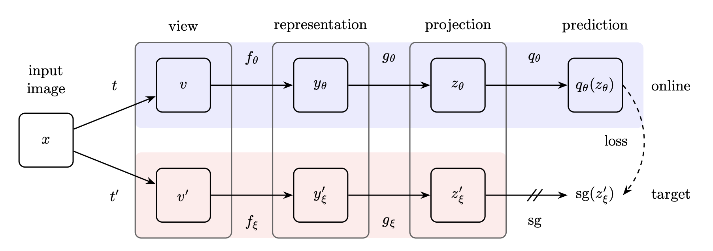

# 📈 BYOL (Bootstrap Your Own Latent)

Welcome to the **BYOL (Bootstrap Your Own Latent)** repository! This project features cutting-edge implementations of the BYOL model—a revolutionary approach in self-supervised learning that eschews negative samples for a more streamlined and efficient training process.

## 🔧 Requirements

To get started with the scripts and experiments in this repository, ensure you have the following dependencies installed:

- **Python 3**: The programming language used for implementation.
- **PyTorch**: The core deep learning library for model training and evaluation.

## 🧠 Model Overview

BYOL is an innovative self-supervised learning algorithm that eliminates the need for negative samples. Instead of contrasting positive and negative samples, BYOL directly minimizes the similarity between representations of the same image under different augmentations (positive pairs). This approach simplifies training and reduces computational overhead compared to traditional contrastive methods.

**Key Highlights:**
- **No Negative Samples**: BYOL trains by only focusing on positive pairs, making it more efficient.
- **State-of-the-Art Performance**: Demonstrates exceptional performance on various image classification tasks.

<h3 align="center">BYOL</h3>

  

## 🚀 Results

This repository explores the impact of BYOL pretraining on the STL10 dataset for a classification task. Here’s a snapshot of the performance improvements:

- **Baseline Accuracy**: Achieved 84.58% accuracy without pretraining.
- **Post-BYOL Pretraining**: Accuracy surged to 87.61% after applying BYOL with 10 epochs of pretraining.

### Implementation Details

For our experiments, we used a ResNet18 model pretrained on the ImageNet dataset as the encoder for BYOL. The knowledge transferred from ImageNet significantly enhanced the model’s performance during BYOL pretraining, highlighting BYOL's effectiveness in boosting classification accuracy.

## 🔍 Summary

The remarkable improvement in classification accuracy underscores BYOL’s potential as a powerful tool in self-supervised learning. This technique not only simplifies training but also achieves superior performance, making it a valuable addition to your machine learning toolkit.
